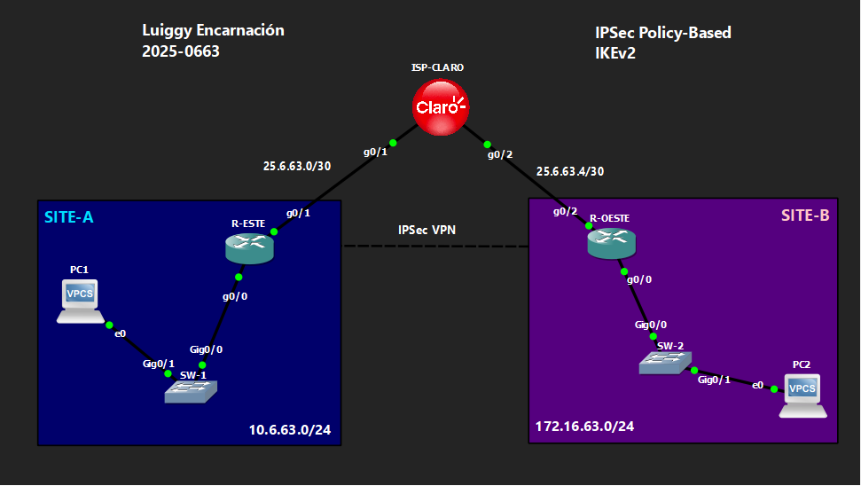

# 🔒 VPN Site-to-Site IPSec Policy-Based — IKEv2
 
**Luiggy Habraham Encarnación Cabrera · Matrícula 2025-0663**
 


> VPN site-to-site IPSec basada en políticas con IKEv2, usando keyring y perfil por peer nombrado.

---

## 📑 Tabla de Contenido

1. [Objetivo del Laboratorio](#-objetivo-del-laboratorio)
2. [Parámetros Usados](#-parámetros-usados)
3. [Documentación de la Red](#️-documentación-de-la-red)
4. [Funcionamiento de la VPN](#-funcionamiento-de-la-vpn)
5. [Configuración](#-configuración)
6. [Verificación](#-verificación)
7. [Capturas de Pantalla](#-capturas-de-pantalla)
8. [Video de Demostración](#-video-de-demostración)

---

## 🎯 Objetivo del Laboratorio

Reproducir el laboratorio de IPSec Policy-Based usando **IKEv2** en lugar de ISAKMP, incorporando `crypto ikev2 profile` con **identidad remota explícita por IP** y un `keyring` nombrado por peer. El objetivo es comparar el nivel de granularidad y control que ofrece IKEv2 frente a IKEv1 en un modelo policy-based (sin interfaz de túnel).

---

## 🧩 Parámetros Usados

| Parámetro | Valor |
|---|---|
| Versión IKE | IKEv2 |
| Cifrado Fase 1 | AES-CBC-256 |
| Integridad Fase 1 | SHA256 |
| Autenticación | Pre-shared key (`Luiggy20250663!`) vía keyring nombrado por peer |
| Grupo DH | 14 |
| Transform-set (Fase 2) | esp-aes 256 / esp-sha-hmac |
| Modo IPSec | Túnel |
| Tráfico interesante | ACL extendida (`VPN_to_SITEB` / `VPN_to_SITEA`) |
| Enrutamiento dinámico | No soportado (sin interfaz de túnel) |

---

## 🗺️ Documentación de la Red

### Topología



### Tabla de Direccionamiento

| Dispositivo | Interfaz | IP | Red |
|---|---|---|---|
| ISP-CLARO | g0/1 | 25.6.63.2/30 | Enlace hacia R-ESTE |
| ISP-CLARO | g0/2 | 25.6.63.5/30 | Enlace hacia R-OESTE |
| ISP-CLARO | Lo0 | 20.20.20.20/32 | Loopback de pruebas |
| R-ESTE | g0/1 (WAN) | 25.6.63.1/30 | Hacia ISP |
| R-ESTE | g0/0 (LAN) | 10.6.63.1/24 | SITE-A |
| R-OESTE | g0/2 (WAN) | 25.6.63.6/30 | Hacia ISP |
| R-OESTE | g0/0 (LAN) | 172.16.63.1/24 | SITE-B |

### Detalles del Entorno

| Parámetro | Valor |
|---|---|
| Emulador | GNS3 / Packet Tracer |
| Dispositivos Cisco | IOU / Router IOS |
| VLANs | VLAN 1 (default) en SW-1 y SW-2 |
| Sitios | SITE-A (10.6.63.0/24), SITE-B (172.16.63.0/24) |

---

## 🔬 Funcionamiento de la VPN

**Fase 1 (IKEv2):**
- `crypto ikev2 proposal IKEV2-PROP`: AES-CBC-256, SHA256, grupo DH 14.
- `crypto ikev2 keyring VPN-KEYRING`: PSK asociada a un **peer nombrado** (`R-OESTE` / `R-ESTE`) con su IP exacta, no a un comodín.
- `crypto ikev2 profile VPN-IKE-PROFILE`: usa `match identity remote address <IP> 255.255.255.255` para exigir identidad exacta — más estricto que el `crypto isakmp key` de IKEv1.

**Fase 2 (IPSec) — sin interfaz de túnel:**
- `transform-set VPN-SET` en **modo túnel**.
- ACL extendida define el tráfico interesante: LAN local hacia LAN remota.
- `crypto map VPN-MAP` combina `set peer`, `set ikev2-profile` y `set transform-set`, aplicado sobre la interfaz WAN física.

**Misma limitación que en IKEv1 policy-based:** al no existir Tunnel0, no hay soporte para enrutamiento dinámico sobre la VPN.

---

## 🔧 Configuración

Ver archivo: `files/config.txt`

---

## ✅ Verificación

```
show crypto ikev2 sa
show crypto ipsec sa
```

Se espera:
- `show crypto ikev2 sa` → SA en estado **READY**.
- `show crypto ipsec sa` → contadores de paquetes cifrados/descifrados incrementando.

---

## 📸 Capturas de Pantalla

```
images/
├── 01_topologia.png
├── 02_show_crypto_ikev2_sa.png
├── 03_show_crypto_ipsec_sa.png
└── 04_wireshark_esp_trafico.png
```

---

## 🎬 Video de Demostración

> 📺 **[Ver demostración en YouTube →](https://youtu.be/FGBrDfl0l4M)**
